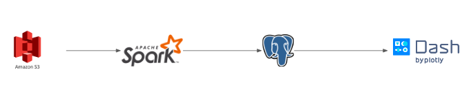

# Identifying triangular arbitrages in the foreign exchange (forex) market

The forex market is a global, decentralized market whose trading volume reached "$6.6 trillion per day in April 2019"<sup>[1](#volume)</sup>. Given the size of the market, it may be possible for traders to profit from even small market inefficiencies.

For my Insight project, I am using forex exchange data to develop a dashbord that clarifies/detects triangular arbitrage opportunities so that traders can know what trades are potentially profitable.

To do this, I had to detect complex relationships among the many different data points.

## Data

There is roughly 200GB of forex data, split among many files. Each file contains the transaction data for a transaction pair in a given month (e.g. USD/EUR for January 2018).

There are 21 currencies and 51 transaction pairs, allowing ~ 60,000 simple cycles. Note: cycle A->B->C->A and and A->C->B->A are counted as separate cycles. Of the cycles that contain US dollar and has only 3 nodes, the number of cycles decreases to 60.

## Setting it up

This program assumes that you have properly set up a Spark Cluster running Python 2. This includes first setting up a VPC and security groups ensuring that communication between the nodes in your cluster are possible.

Beyond that, the following libraries are used and can be installed using pip:
- psycopg2 -- a python library for interacting with databases
- pgcopy -- a library built on top of psycopg2 that allows faster writes to database
- boto3 -- a library allowing interactions with AWS S3 from within python
- smart_open -- a library built on top of boto3 that allows you to stream files from AWS S3
- csv -- a built-in python library for parsing csv files

Lastly, secret information pertaining to the IP address of your database and AWS keys are stored in a separate file (see `db.config` for a template). After filling in the relevant information in 'db.config', rename it to `config.txt` as that's what the program is currently set up to read.


## Running

The command to run the program is
```bash
spark-submit --master spark://<host-private-ip>:7077 --files config.txt,forex.keys,cycles.txt,src/arbitrage.py src/main.py
```
where `<host-private-ip>` is the private IP of the master node in your spark cluster.

A simple bash script (`run.sh`) has been written to help the user run the program, but `<host-private-ip>` would first need to be replaced.

## Data source

The forex data was downloaded from [histdata.com](https://www.histdata.com). The particular data was their "Generic ASCII in Ticks" data.


## Architecture



The pipeline works as follows. First, Spark tells different worker nodes in the cluster which batch of data to work on (e.g. Jan 2006 or July 2013). The worker then finds the data in AWS S3, streams the relevant files, processes them, and outputs the results into a PostgreSQL database. Lastly, the data from the database is pulled and plotted in Dash for the user.

## Engineering challenges and design

There were 2 main challanges and 1 design choice involed in this project.

### Challenges:

1. Because the amount of data involved, it was not possible to read all of the data for a particular month (e.g. April 2010) into memory and make full use of the parallel processing capabilities provide by the cluster. So, the data were moved into AWS S3 and streamed from there instead.
2. The data are asychronous and comes in at different frequencies, so a buffer was built to look into the files and output only the ones with the latest timestamp.

### Design:

I have used Spark to distribute the queue of batches to process (e.g. data for 01-2006, data for 02-2006, ..., data for 12-2018) to the worker nodes, but something similar could accomplished using a message broker such as Kafka.

By using a message queue, the pipeline becomes elastic in the sense that additional nodes can be added or removed depending on the work load. However, it would not provide fault tolerance by default. Without additional set-up, if a node fails after receiving its job, the message broker would not know to assign the failed task to some other node.

Spark, on the other hand, would be fault-tolerant but would not be elastic. Should a task fail within Spark, Spark would restart the task. However, once a Spark job has started, the number of worker nodes involved cannot be changed. You'd have to either live with your number of worker nodes or stop the Spark job and run a new one.

I have chosen the Spark approach because my work queue is fixed and so elasticity is less important.

## Footnotes

<a name="volume">1</a>. 2019 Triennial Survey published by the Bank for International Settlements (BIS).
